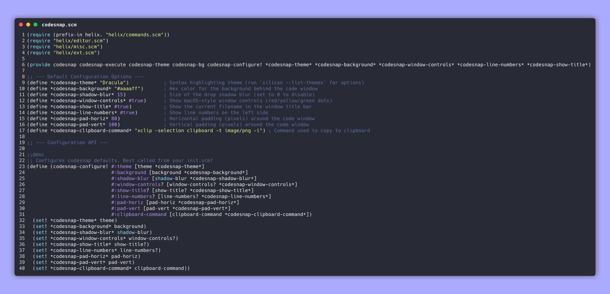

# codesnap.hx



A simple plugin for [Helix](https://github.com/helix-editor/helix) (using the [Steel plugin branch](https://github.com/mattwparas/helix)) that takes screenshots of your code and copies them to your clipboard. 

Similar to CodeSnap or Polacode for VS Code, but for Helix. It pipes your current visual selection to [silicon](https://github.com/Aloxaf/silicon) to generate the image.

## Requirements

1. **Helix with Steel**: You need a build of Helix that includes the Scheme/Steel plugin system.
2. **Silicon**: Does the actual image generation.
   ```bash
   cargo install silicon
   ```
3. **A clipboard tool**: Defaults to `xclip` (X11). If you use Wayland (`wl-copy`) or macOS (`pbcopy`), you'll need to edit the clipboard command at the top of `codesnap.scm`.

## Installation

Install the plugin using `forge` (the Steel package manager):

```bash
forge pkg install --git https://github.com/Vyrnexis/codesnap.hx.git
```

Then add these lines to your `~/.config/helix/helix.scm` file to register the commands:

```scheme
(require (only-in "codesnap/codesnap.scm" codesnap codesnap-save codesnap-theme codesnap-bg))
(provide codesnap codesnap-save codesnap-theme codesnap-bg)
```

## Usage

Make a visual selection (`v` or `x`) of the code you want to capture, then run one of the following commands:

- `:codesnap` — Captures the selection and copies it to your clipboard.
- `:codesnap-save <path>` — Saves the screenshot to a specific file instead of the clipboard (e.g. `:codesnap-save ~/Desktop/code.png`).
- `:codesnap-theme <theme_name>` — Overrides the current syntax highlighting theme (e.g. `:codesnap-theme Nord`). Run `silicon --list-themes` in your terminal to see what's installed.
- `:codesnap-bg <hex>` — Overrides the current background color (e.g. `:codesnap-bg #ffb86c`).

## Configuration

If you want to change the default theme, padding, shadows, or your clipboard utility, you can find the installed file at `~/.local/share/steel/cogs/codesnap/codesnap.scm` and edit the variables at the top of the file:

```scheme
(define *codesnap-theme* "Dracula")            
(define *codesnap-background* "#aaaaff")       
(define *codesnap-shadow-blur* 15)             
(define *codesnap-window-controls* #true)      
(define *codesnap-line-numbers* #true)         

;; Change this if you are on Wayland (wl-copy) or macOS (pbcopy)
(define *codesnap-clipboard-command* "xclip -selection clipboard -t image/png -i")
```
